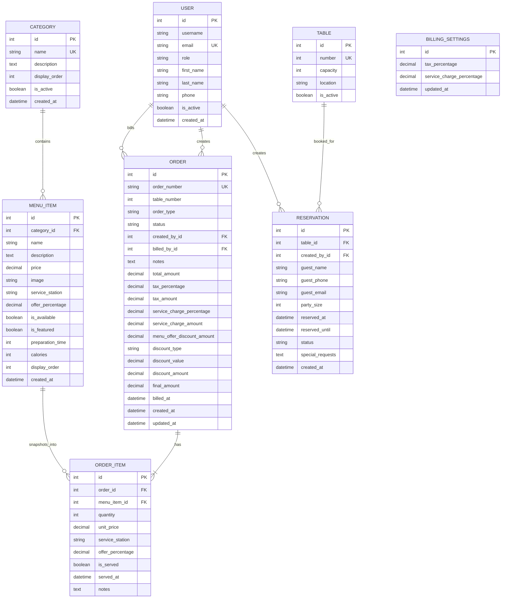

# Restaurant App Diagrams

These diagrams are based on the current codebase in `backend/apps/*` and the role rules enforced in the API.

## Use Case Diagram

```mermaid
flowchart LR
    admin[Admin]
    manager[Manager]
    waiter[Waiter]
    kitchen[Kitchen]

    subgraph auth["Authentication & Staff"]
        login([Log in / refresh session])
        me([View own profile])
        password([Change password])
        users([Manage staff users])
    end

    subgraph menu["Menu Management"]
        menu_read([Browse menu and categories])
        menu_manage([Create / update menu items and categories])
        availability([Toggle menu availability])
        offers([Set menu-wise offer discount])
        station([Set service station: kitchen or counter])
    end

    subgraph reservations["Reservations & Tables"]
        reserve([Create / update reservations])
        reserve_status([Update reservation status])
        reserve_delete([Delete reservation])
        table_read([View tables and availability])
        table_manage([Create / update / delete tables])
    end

    subgraph orders["Order Lifecycle"]
        order_create([Create order])
        order_add([Add items or append notes to existing order])
        order_live([View active orders])
        kitchen_queue([View kitchen queue])
        status_flow([Move order through status flow])
        counter_serve([Serve counter items])
        bill([Finalize bill])
        pdf([Download bill PDF])
        notify([Receive live order notifications])
    end

    subgraph reports["Reporting & Billing Setup"]
        settings([Configure global tax and service charge])
        dashboard([View dashboard report])
        revenue([View revenue report])
        bills([View billed orders report])
        top_items([View top-items report])
        orders_report([View orders analytics])
        reservations_report([View reservation analytics])
        staff_report([View staff performance report])
    end

    admin --> login
    admin --> me
    admin --> password
    admin --> users
    admin --> menu_read
    admin --> menu_manage
    admin --> availability
    admin --> offers
    admin --> station
    admin --> reserve
    admin --> reserve_status
    admin --> reserve_delete
    admin --> table_read
    admin --> table_manage
    admin --> order_create
    admin --> order_add
    admin --> order_live
    admin --> status_flow
    admin --> counter_serve
    admin --> bill
    admin --> pdf
    admin --> notify
    admin --> settings
    admin --> dashboard
    admin --> revenue
    admin --> bills
    admin --> top_items
    admin --> orders_report
    admin --> reservations_report
    admin --> staff_report

    manager --> login
    manager --> me
    manager --> password
    manager --> users
    manager --> menu_read
    manager --> menu_manage
    manager --> availability
    manager --> offers
    manager --> station
    manager --> reserve
    manager --> reserve_status
    manager --> table_read
    manager --> table_manage
    manager --> order_create
    manager --> order_add
    manager --> order_live
    manager --> status_flow
    manager --> counter_serve
    manager --> bill
    manager --> pdf
    manager --> notify
    manager --> settings
    manager --> dashboard
    manager --> revenue
    manager --> bills
    manager --> top_items
    manager --> orders_report
    manager --> reservations_report
    manager --> staff_report

    waiter --> login
    waiter --> me
    waiter --> password
    waiter --> menu_read
    waiter --> reserve
    waiter --> reserve_status
    waiter --> table_read
    waiter --> order_create
    waiter --> order_add
    waiter --> order_live
    waiter --> counter_serve
    waiter --> status_flow
    waiter --> notify

    kitchen --> login
    kitchen --> me
    kitchen --> password
    kitchen --> menu_read
    kitchen --> order_live
    kitchen --> kitchen_queue
    kitchen --> status_flow
    kitchen --> notify
```

## ERD

## Notes

- `BillingSettings` is effectively a singleton global setup table used during billing.
- `Order.table_number` is stored directly on the order and is not a foreign key to `Table`.
- `OrderItem.service_station` and `OrderItem.offer_percentage` are snapshots from `MenuItem`, so historical bills remain stable even if the menu changes later.
- Reports are generated from `Order`, `OrderItem`, and `Reservation` data and do not have their own persistent report tables.
